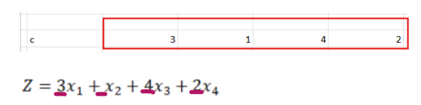
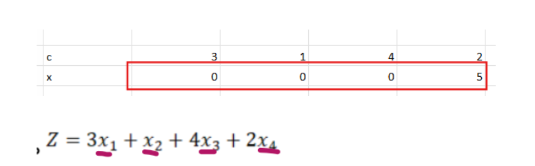
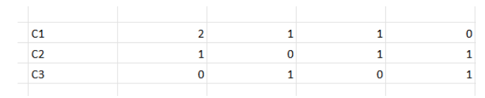
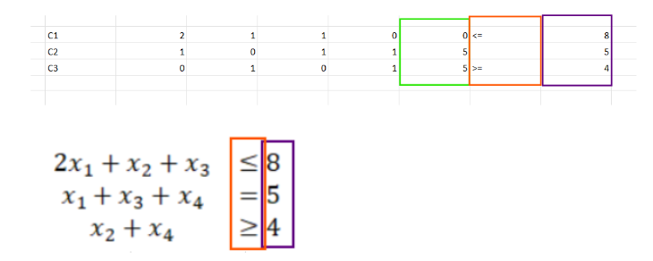
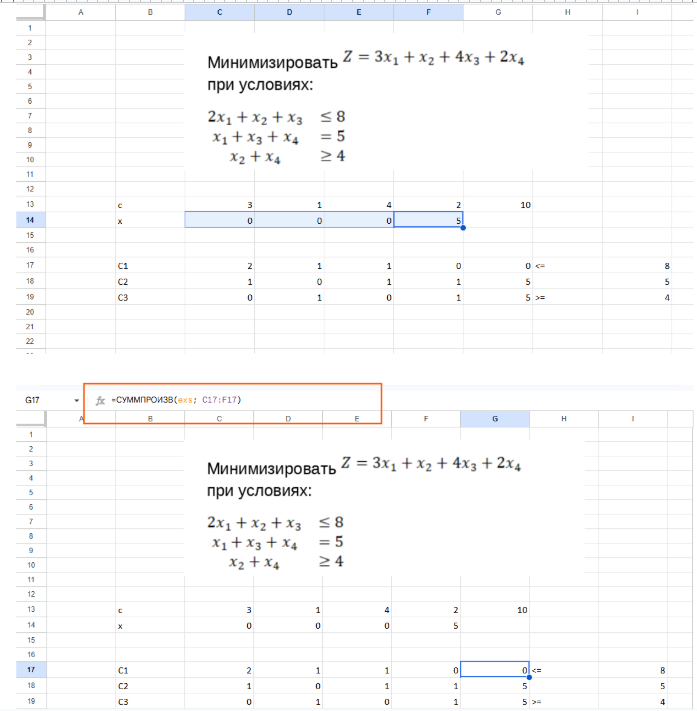
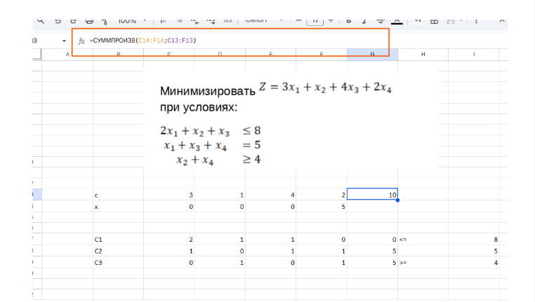
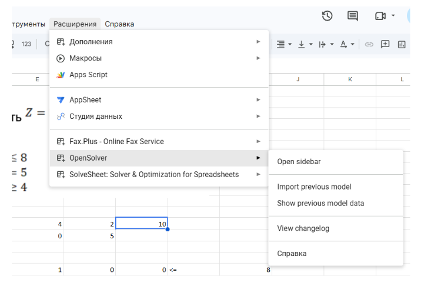
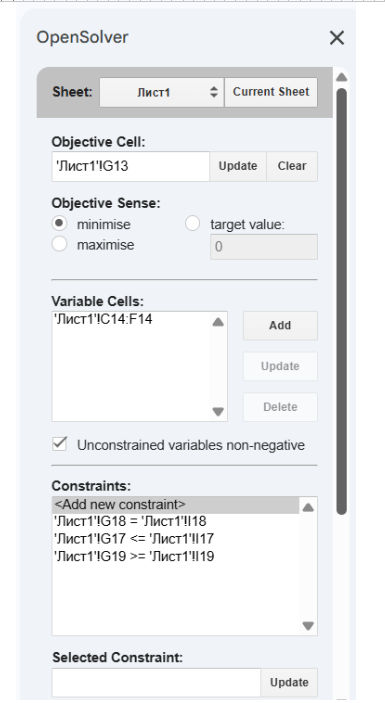
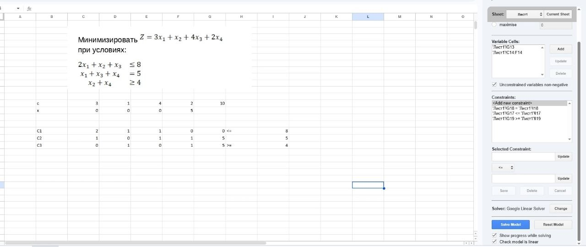
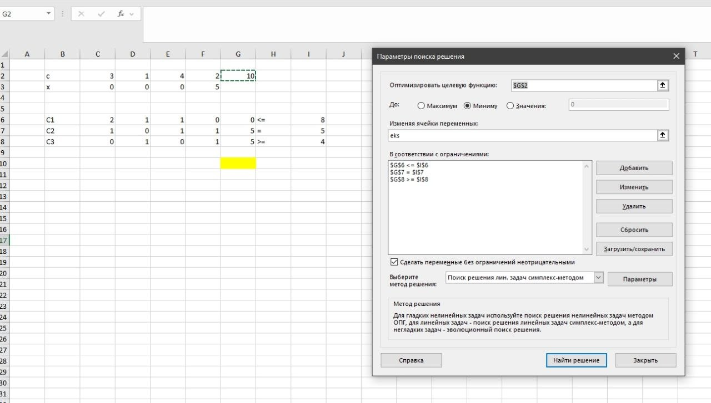

# Реализация Симплекс метода с помощью Excel

Для решения этого пункта я использовала microsoft excel c надстройкой “Solver” и google sheets c расширением “OpenSolver”.

Объясню решение на примере OpenSolver. 
Нам дан задача

1. Для начала запишем все коэффициенты целевой функции Z.

2. Запишем начальные(предполагаемые) значения x целевой функции, обычно в начале ставят все x равные 0, но можно предположить и свои значения, на расчеты это никак не повлияет, так как расширение будет потом самостоятельно пересчитывать x.

3. Выпишем коэффициенты ограничений

4. Справа от этих коэффициентов необходимо выделить столбец под получающиеся значения, знак неравенства/равенства, требуемое условие

5. В столбец, который мы выделили для расчеты текущего значения каждого ограничения при пересчете x, необходимо вставить формулу.

Диапазон x1, x2, x3, x4 я отметила названием exs для удобства использования.

В ячейку мы вставляем формулу =СУММПРОИЗВ(exs; C17:F17), а затем растягиваем на все ограничения.
Что делает эта формула?
Каждый коэффициент перемножает с соответствующим xб а затем суммирует.

6. Похожую формулу необходимо реализовать и для целевой функции

7. Необходимо нажать на кнопку расширения и выбрать OpenSolver(если расширения нет - установить в магазине).

8. Открываем панель управления -> Open sidebar

9. В Objective Sense выбираем что хотим сделать, в нашем случае - минимизировать функцию

10. В Variable Cells указываем диапазон x, значения которых мы хотим подобрать. В моем случае, x хранятся в ячейках C14:F14

11. В Constraints указываем все данные ограничения

12. Нажимаем на кнопку Solve Model и получаем ответ

13. Результаты

